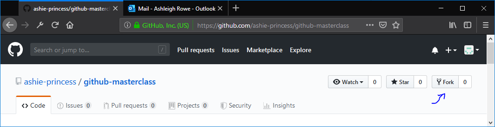

# Masterclass for Github

Hiya! this masterclass was designed to help you learn how to use github and git! by the end of this, you'll have added yourself to a demo site, using only the power of git! We'll be covering Forking, Committing and Making a PR (Pull Request)

## How to create your profile on the demo site

### Using Github Desktop client

#### Creating an Account

The presentation in class will take you through the steps of creating an account, but it's quite simple! Follow those steps and once done, you'll have Github Desktop setup with your account!

#### Forking

A neat feature with github is the "forking" feature. this is where it will "clone" a repository into your own user under the same name, it's useful for working on code you don't have write permissions for, and then you can send the code back to the original developer, if you want to!

To Fork this repository, click the button in the top right labelled "fork"



#### Downloading the Code

Go back to Github Desktop Client and click File>Clone Repository and then select the recently forked repository that was done in the previous step. Choose a location (On BCU Machines, try the V Drive, under a folder of your name, that way it's got plenty of space and is easily accessible) Once downloaded, proceed to the next step.

#### Editing the Code

Now we get onto the important bit! We're going to make changes so that you appear on the website! I've got this website setup in a very basic way, so that you can add a file, and it will automativally populate the website with the contents!

Open up explorer, and navigate to your previously cloned directory (Try the V: Drive) and go to the folder `_users` and you should see a file called `ahaxie.yaml` make a copy and rename it to whatever your name is, and make sure to keep the `.yaml` extension

Right click your newly created file and select `Open With`. Choose Visual Studio Code (or your favourite text editor!) and open it up for modification. You should see something like this:

```YAML
---
name: Ashleigh Haxie
image: https://avatars3.githubusercontent.com/u/36836545?s=460&v=4
emoji: 🐱
message: I'm Asheligh and this is a test!
twitter: AshleighHaxie
github: ashie-princess
web: https://haxie.dev
---
```

Modify each of these to whatever you like! Any of these fields can also be deleted (except name and image) so if you don't want to add something, don't!

#### Committing

Once done, save the file and go back to git desktop, and you should see that it's picked up your changes! on the left, type in a Summary and Description of what you did, and then click `Commit to master` followed by clicking the big button labelled "Push origin" at the top

#### Making a Pull Request

Once you've committed your work, it's up in the cloud now! to submit a pull request, we need to go back to the github website and back to this repository to submit a pull request.

At the top of the repository is a botton labelled "Pull Requests" Select that and click "New Pull Request". If github doesn't detect your fork automatically, click the `compare across forks` button, and it should be able to show it, make sure the one on the left says `ashie-princess/github-masterclass` and the one on the right says your fork's name like below!


Once you've clicked that, click "create pull request" again, and you are done!

### Using git commandline

### TODO

### Using GitHub.com

### TODO2
